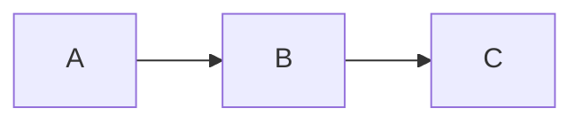
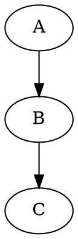
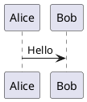

# Marked

A VSCode-like H5 markdown editor for Google Drive — served as a GitHub Pages static app with full diagram support.

**Live app:** https://leafai.github.io/marked/

## Features

- **Monaco Editor** — the same engine that powers VSCode, with markdown syntax highlighting
- **Google Drive integration** — browse, open, and save `.md` / `.markdown` files directly from Drive
- **Live preview** — side-by-side markdown rendering with scroll sync
- **Diagram support** — configurable renderers per diagram type:
  - Mermaid: `mermaid.js` (local) / `mermaid.ink` / Kroki
  - GraphViz/DOT: Kroki
  - PlantUML / C4 PlantUML: `plantuml.com` server / Kroki
  - Ditaa and more via Kroki
- **Math** — KaTeX inline and block math
- **Outline panel** — heading tree with click-to-scroll
- **File explorer** — full Google Drive folder tree
- **VSCode-like layout** — activity bar, resizable panels, tab bar, status bar
- **Dark theme** — VSCode Dark+ color scheme
- **Zero backend** — pure static SPA, deploy anywhere

## Quick Start

### Development

```bash
npm install
npm run dev        # Vite dev server with hot reload
```

Open http://localhost:5173

### Preview production build locally

```bash
npm run build      # Build to dist/
npm run preview    # Serve dist/ via Vite preview
```

### Deploy to GitHub Pages

Push to `main` — GitHub Actions builds and deploys automatically.

## Google Drive Setup

1. Go to [Google Cloud Console](https://console.cloud.google.com/) and create a project.
2. Enable the **Google Drive API**.
3. Create an **OAuth 2.0 Client ID** — type: **Web application**.
4. Under **Authorised JavaScript origins** add:
   - `https://leafai.github.io` (production)
   - `http://localhost:5173` (Vite dev)
   - `http://localhost:4173` (Vite preview)
   - No redirect URIs needed — authentication uses a popup, not a redirect.
5. Open the app → click the ⚙ Settings icon → paste your Client ID → click the Drive icon → Connect.

The Client ID is stored in `localStorage` — it never leaves your browser.

## Diagram Syntax

````markdown






```c4plantuml
@startuml
!include C4_Context.puml
Person(user, "User")
System(app, "Marked")
Rel(user, app, "Uses")
@enduml
```
````

## Renderer Configuration

Click the **Settings** icon (gear) in the activity bar to switch renderers:

| Diagram | Options |
|---------|---------|
| Mermaid | `mermaid.js` (local, default) · `mermaid.ink` · Kroki |
| PlantUML / C4 | `plantuml.com` (default) · Kroki |
| GraphViz | Kroki |

## Development

```
marked/
├── src/              # React + TypeScript frontend
│   ├── components/   # UI components
│   ├── services/     # Google Drive API, markdown rendering
│   └── store/        # Zustand state management
└── .github/          # CI/CD workflows
```

See [DESIGN.md](DESIGN.md) for architecture details and [AGENTS.md](AGENTS.md) for AI agent guidance.

## Contributing

See [CONTRIBUTING.md](CONTRIBUTING.md). All contributions welcome!

## License

[MIT](LICENSE) © LeafAI
